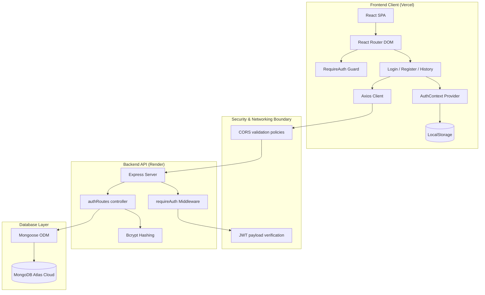

# 🔐 Enterprise Login & Registration System (MERN Stack Architecture)
A decoupled, secure full-stack authentication portal built with **React**, **Node.js**, **Express**, and **MongoDB Atlas**. Designed with modern fluid layouts, mobile-first responsiveness, stateless authentication, and enterprise-grade security boundaries.
---
## 🌐 Live Demo | Production Deployments
*   **Frontend Client (Vercel):** [loginandregistration.vercel.app](https://loginandregistration-fok9.vercel.app/)
*   **Backend REST API (Render):** [loginandregistration.onrender.com](https://loginandregistration-rd3v.onrender.com/)
*   **Source Repository:** [arivalagan-tech/loginandregistration](https://github.com/arivalagan-tech/loginandregistration)
---
## 📁 Project Directory Structure
```text
loginandregistration/
│
├── backend/                                      # Backend Node.js/Express server codebase
│   │
│   ├── config/                                   # Configuration modules
│   │   └── db.js                                 # Database helper initiating Mongoose connections to MongoDB Atlas
│   │
│   ├── middleware/                               # Express middleware interceptors
│   │   └── auth.js                               # JWT verification middleware guarding private routes and injecting request context
│   │
│   ├── models/                                   # Mongoose data schemas
│   │   └── User.js                               # User model schema with validation (name, email, password, dob, createdAt)
│   │
│   ├── routes/                                   # REST API routing controllers
│   │   └── auth.js                               # Authentication router controller for registration, login, logout, and profile
│   │
│   ├── .env.example                              # Reference file outlining mandatory environment variables (secrets, URIs)
│   ├── index.js                                  # Application bootstrapper defining middleware stack, CORS, routing, and ports
│   └── package.json                              # Project metadata, dependencies (bcrypt, jwt, mongoose), and runtime scripts
│
├── frontend/                                     # Frontend React client codebase (Vite build system)
│   │
│   ├── public/                                   # Raw static assets exposed directly to client builds
│   │   ├── Log In Bgm.png                        # Background graphic for the login screen page
│   │   ├── Sign Up.png                           # Background graphic for the registration screen page
│   │   ├── SignUpIcon.png                        # Icon asset representation used in form cards
│   │   ├── apple.png                             # Branding asset for OAuth Apple sign-in emulation
│   │   ├── eye.png                               # Legacy asset fallback for password toggles
│   │   ├── icons8-facebook.png                   # Branding asset for OAuth Facebook sign-in emulation
│   │   ├── icons8-google.png                     # Branding asset for OAuth Google sign-in emulation
│   │   ├── login.png                             # Design visual asset representing user login entry
│   │   ├── logo_highbridge.png                   # Legacy brand logo graphic asset
│   │   └── vite.svg                              # Default Vite icon template asset
│   │
│   ├── src/                                      # Application React components source directory
│   │   │
│   │   ├── assets/                               # Compiled visual resource files
│   │   │   └── react.svg                         # React project template asset file
│   │   │
│   │   ├── components/                           # React functional rendering views
│   │   │   ├── History.jsx                       # User audit log view displaying profile history, formats metadata, and layouts cards
│   │   │   ├── Login.jsx                         # Main sign-in component with floating labels, eye toggle, validation, and Axios
│   │   │   ├── Register.jsx                      # Account creation component containing date controls and form processing
│   │   │   └── RequireAuth.jsx                   # Higher-Order client-side route guard securing the History page path
│   │   │
│   │   ├── context/                              # Shared application state providers
│   │   │   └── AuthContext.jsx                   # Central state machine managing session variables, tokens, and storage
│   │   │
│   │   ├── css/                                  # Local stylesheet assets
│   │   │   ├── Login.css                         # Page-specific styling rules, viewport boundaries, and floating label transitions
│   │   │   ├── Register.css                      # Registration forms style sheet containing custom date input adapters
│   │   │   └── history.css                       # Audit page layout containing responsive card table queries and pagination rules
│   │   │
│   │   ├── Images/                               # Source images package compiled directly into the application bundles
│   │   │   ├── Log In Bgm.png                    # Login page wallpaper element
│   │   │   ├── Q-image.webp                      # Optimized branding logo for the registration page banner
│   │   │   ├── Q-img.webp                        # Optimized branding logo for the login page banner
│   │   │   ├── Sign Up.png                       # Signup page wallpaper element
│   │   │   ├── SignUpIcon.png                    # Legacy icon element file
│   │   │   ├── apple.png                         # Branding asset vector
│   │   │   ├── icons8-delete-user-male-96.png    # Interactive icon asset representing audit removal
│   │   │   ├── icons8-delete.png                 # Alternative trash icon representation
│   │   │   ├── icons8-facebook.png               # Facebook visual logo asset
│   │   │   ├── icons8-google.png                 # Google visual logo asset
│   │   │   ├── icons8-security.png               # Security lock audit icon asset
│   │   │   ├── login.png                         # Graphic design asset representation
│   │   │   ├── logo_highbridge.png               # Highbridge graphic banner fallback
│   │   │   ├── time_1759335.png                  # Time tracking visual logo asset
│   │   │   ├── user1.jpg                         # Mock avatar image 1
│   │   │   ├── user2.jpg                         # Standard active user profile avatar image
│   │   │   ├── user3.jpg                         # Mock avatar image 3
│   │   │   ├── user4.jpg                         # Mock avatar image 4
│   │   │   └── user5.jpg                         # Mock avatar image 5
│   │   │
│   │   ├── App.css                               # Root App global class style configuration
│   │   ├── App.jsx                               # Root parent router layout configuring routing and shared navigation structure
│   │   ├── index.css                             # Central layout design stylesheet containing glassmorphic overrides
│   │   └── main.jsx                              # Client bootstrapper loading React virtual DOM and global providers
│   │
│   ├── eslint.config.js                          # Static analysis config file asserting code standard validations
│   ├── index.html                                # HTML shell container serving as mount target for the application
│   ├── package.json                              # Main frontend descriptor file defining React versions, build tooling, and dependencies
│   ├── vercel.json                               # Deployment instructions configuring router rewrites for SPA page routing
│   └── vite.config.js                            # Vite packager config defining asset processing pipelines and plugins
│
├── LICENSE                                       # Software license guidelines
└── README.md                                     # System documentation file
```
---
## 🏗 System Architecture

---
## 🔑 Technical Workflows & Step-by-Step Flows
### 1. User Registration Flow
```text
1. CLIENT: User submits Register form (name, dob, email, password)
2. CLIENT: Axios client sends POST request to /api/auth/register
3. SERVER: Express receives request -> parses JSON body
4. SERVER: Route handler verifies presence of all required fields
5. SERVER: Mongoose queries User collection to verify email uniqueness
6. SERVER: Bcrypt generates salt (10 rounds) and hashes raw password
7. DATABASE: User record created in MongoDB Atlas containing hashed password
8. SERVER: Express signs JWT token containing user _id and email
9. SERVER: Express sends Cookie payload and returns JSON response with token and user object
10. CLIENT: AuthContext stores token in localStorage and updates global user state
11. CLIENT: Router redirects user to /history page
```
### 2. User Login Flow
```text
1. CLIENT: User enters email and password -> submits Login form
2. CLIENT: Axios submits POST request to /api/auth/login
3. SERVER: Express receives inputs -> queries database for lowercase email
4. DATABASE: MongoDB retrieves user record
5. SERVER: Bcrypt compares inputted password with stored password hash
6. SERVER: On verification match, signs JWT containing user ID and email
7. SERVER: Express configures HttpOnly token cookie (secure flag set in production)
8. SERVER: Returns JSON response containing token and user profile
9. CLIENT: AuthContext intercepts response -> writes loggedUser and authToken to localStorage
10. CLIENT: Router performs client-side redirect to /history page
```
### 3. JWT Validation & Protected Route Flow
```text
1. CLIENT: User attempts to render /history page
2. CLIENT: RequireAuth checks AuthContext -> verifies if token exists in localStorage
3. CLIENT: If token exists, RequireAuth renders component -> executes useEffect hook
4. CLIENT: Axios client reads token -> appends token to header: Authorization: Bearer <token>
5. CLIENT: Axios fires GET request to /api/auth/profile
6. SERVER: Express interceptor routes request through requireAuth middleware
7. SERVER: Middleware checks authorization header -> extracts token string
8. SERVER: JWT.verify decrypts token with JWT_SECRET -> verifies expiration & integrity
9. SERVER: Middleware attaches decoded values to req.user object -> calls next()
10. SERVER: Controller queries MongoDB for user record by user ID -> excludes password field
11. DATABASE: MongoDB returns user record
12. SERVER: Controller returns JSON response -> client renders user details
```
---
## 🛡 Security Architecture
1.  **Stateless Cryptographic Sessions**: Session contexts are packaged as JSON Web Tokens signed with a HMAC SHA-256 key (`JWT_SECRET`). Token boundaries prevent data manipulation.
2.  **Cryptographic Password Hashing**: Passwords undergo one-way cryptographic hashing using `bcrypt` (10 rounds of salt generation) before database storage, preventing password exposure in case of data leaks.
3.  **HTTP-Only & Secure Cookies**: Authentication tokens are configured as HttpOnly cookie payloads on the server to prevent Cross-Site Scripting (XSS) access. Secure cookies require HTTPS in production environments.
4.  **Protected Routes (Route Guards)**:
    *   **Frontend Guard**: The `RequireAuth` component wraps React components. If a session token is missing, the guard redirects the user to the login screen, preserving target paths in the router state.
    *   **Backend Guard**: The `requireAuth` middleware protects API routes. Requests missing valid or unexpired Authorization headers are rejected with an HTTP `401 Unauthorized` status.
5.  **Strict CORS Configuration**: Cross-Origin Resource Sharing (CORS) rules specify valid origin requests to secure the backend API.
6.  **MongoDB Schema Validation**: Mongoose enforces unique email constraints, lowercase sanitization, and name lengths.
---
## 📱 Responsive Layout Strategy
The application is built using a mobile-first responsive strategy that scales seamlessly from small screens to high-resolution desktop monitors.
|
 Breakpoint 
|
 Devices 
|
 Layout Strategy 
|
|
:---
|
:---
|
:---
|
|
**
`< 768px`
**
|
 Mobile (e.g. iPhone SE, Portrait tablets) 
|
**
Single-column vertical stack
**
. Hero elements scale down. Tables transform into individual card lists using the 
`data-label`
 attribute. Navigation menus stack to prevent horizontal scrolling. 
|
|
**
`768px - 1024px`
**
|
 Tablet Landscape 
|
**
Stacked fluid grid
**
. Paddings contract and margins align. Search bar expands to full width. 
|
|
**
`>= 1024px`
**
|
 Laptops & Desktop Viewports 
|
**
Two-column side-by-side flex layout
**
. Hero elements on the left, form cards on the right. Content is vertically centered to fit within a single viewport, preventing scrollbars on load. 
|
### Responsive Table Architecture (Mobile Cards)
Standard HTML tables require horizontal scrolling on mobile screens. To solve this, this application utilizes a custom media query structure:
```css
@media (max-width: 767px) {
  table, thead, tbody, th, td, tr { display: block; }
  thead { display: none; } /* Hide headers */
  td[data-label]::before {
    content: attr(data-label); /* Inject column header on the left */
    float: left;
    font-weight: 600;
  }
}
```
This converts each table row into an independent card block with labels displayed on the left and values on the right, ensuring readability on screens down to `320px`.
---
## 🌐 API Endpoint Specifications
All endpoints are prefixed with `/api/auth`.
|
 Endpoint 
|
 Method 
|
 Security 
|
 Request Payload 
|
 Response (Success) 
|
 HTTP Code 
|
|
:---
|
:---
|
:---
|
:---
|
:---
|
:---
|
|
`/register`
|
`POST`
|
 Public 
|
`{ name, dob, email, password }`
|
`{ message: "Registered", user, token }`
|
`201 Created`
|
|
`/login`
|
`POST`
|
 Public 
|
`{ email, password }`
|
`{ message: "Logged in", user, token }`
|
`200 OK`
|
|
`/logout`
|
`POST`
|
 Public 
|
 None 
|
`{ message: "Logged out" }`
|
`200 OK`
|
|
`/profile`
|
`GET`
|
 Protected 
|
 None (Bearer Token in Header) 
|
`{ user: { _id, name, email, dob, createdAt } }`
|
`200 OK`
|
---
## 🗄 Database Architecture & Schemas
The application uses MongoDB Atlas as a cloud document database, configured with a single `User` collection.
```text
User Schema:
├── _id          : ObjectId  (Auto-generated unique identifier)
├── name         : String    (Required, trimmed, maximum 100 characters)
├── email        : String    (Required, lowercase, unique, trimmed)
├── password     : String    (Required, stored as a one-way bcrypt hash)
├── dob          : Date      (Required, stored as ISO date format)
└── createdAt    : Date      (Auto-generated timestamp, default: Date.now)
```
---
## 🛠 Technology Stack Breakdown
### Frontend Stack
*   **React & JSX**: Component-based UI framework for building modular, interactive components.
*   **Vite**: Fast frontend build tool that leverages native ES modules for quick hot-module reloading.
*   **React Router DOM (v7)**: Manages client-side routing, protected routes, and deep linking.
*   **Axios**: Promise-based HTTP client for executing asynchronous API requests to Render backend servers.
*   **React Toastify**: In-app notifications for displaying user errors and success messages.
### Backend Stack
*   **Node.js & Express**: Event-driven runtime environment and routing framework for building the REST API.
*   **Mongoose ODM**: Object Data Modeling library for mapping JavaScript objects to MongoDB documents with validation rules.
*   **JSON Web Tokens (JWT)**: Secure token transmission for stateless user authentication.
*   **Bcrypt**: Password hashing function designed to resist brute-force search attacks.
*   **Cookie Parser**: Express middleware helper to parse and validate incoming browser cookies.
---
## 🚀 Local Installation & Execution
### Prerequisites
*   Node.js (v18.x or higher)
*   npm (v9.x or higher)
*   MongoDB Atlas Account or local MongoDB Server instance
### 1. Clone the Repository
```bash
git clone https://github.com/arivalagan-tech/loginandregistration.git
cd loginandregistration
```
### 2. Configure Backend Server
```bash
cd backend
npm install
```
Create a `.env` file inside the `backend` folder:
```env
PORT=5000
MONGO_URI=your_mongodb_atlas_connection_string
JWT_SECRET=your_jwt_signing_key_secret
JWT_EXPIRES_IN=7d
COOKIE_NAME=token
NODE_ENV=development
```
Start the development server:
```bash
npm run dev
```
### 3. Configure Frontend Client
```bash
cd ../frontend
npm install
```
Start the frontend development server:
```bash
npm run dev
```
Open your browser and navigate to `http://localhost:5173`.
